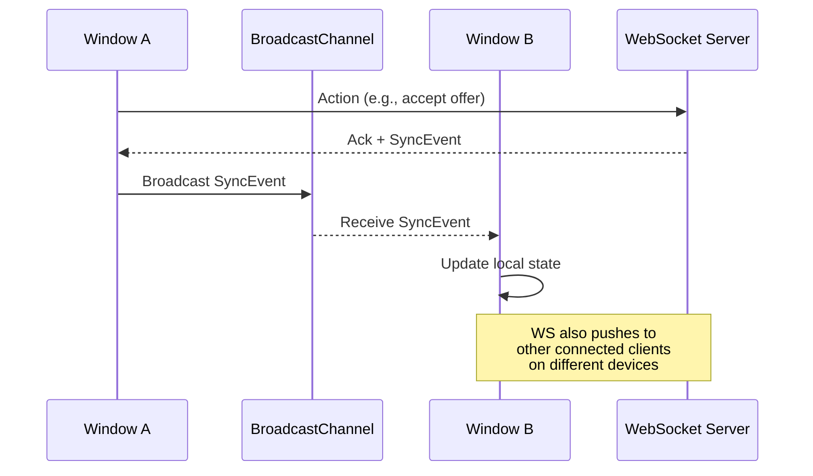

# OtakuBazaar — Clean Architecture Foundation

A production-grade Next.js 15 (App Router) + TypeScript scaffold for an Amazon/OLX-scale C2C anime marketplace, organized as strict Clean Architecture with real-time multi-window sync.

## Proposed Changes

### 1. Project Scaffolding

#### [NEW] `otaku-bazaar/` — Next.js 15 App Router project

Bootstrapped via `create-next-app` with:
- TypeScript (strict mode, no `any`)
- App Router (no Pages Router)
- ESLint
- `src/` directory enabled
- Import alias `@/*` → `src/*`

After scaffold, the default `src/app` contents will be cleaned and restructured into the Clean Architecture layers below.

---

### 2. Clean Architecture — Directory Map

```
otaku-bazaar/
├── src/
│   ├── domain/                         # Layer 0 — Pure business core (ZERO external deps)
│   │   ├── entities/
│   │   │   ├── Listing.ts              # Listing aggregate root
│   │   │   ├── BargainOffer.ts         # Bargain/negotiation entity
│   │   │   └── User.ts                 # User entity
│   │   ├── value-objects/
│   │   │   ├── Money.ts                # Immutable money value object (amount + currency)
│   │   │   ├── ListingStatus.ts        # Enum-like discriminated union
│   │   │   └── OfferStatus.ts          # Enum-like discriminated union
│   │   ├── repositories/
│   │   │   ├── IListingRepository.ts   # Port interface for listings persistence
│   │   │   └── IBargainOfferRepository.ts
│   │   ├── events/
│   │   │   └── DomainEvent.ts          # Domain event base + concrete event types
│   │   └── types/
│   │       └── index.ts                # Centralized shared types (IDs, branded types)
│   │
│   ├── application/                    # Layer 1 — Use cases & orchestration
│   │   ├── use-cases/
│   │   │   ├── CreateListingUseCase.ts
│   │   │   └── AcceptBargainOfferUseCase.ts
│   │   ├── dtos/
│   │   │   ├── CreateListingDTO.ts
│   │   │   └── AcceptBargainOfferDTO.ts
│   │   ├── ports/
│   │   │   ├── IPaymentGateway.ts      # Port for Razorpay / payment infra
│   │   │   ├── IShippingProvider.ts    # Port for Shiprocket / shipping infra
│   │   │   └── IEventBus.ts           # Port for publishing domain events
│   │   └── errors/
│   │       └── ApplicationErrors.ts    # Custom typed error hierarchy
│   │
│   ├── infrastructure/                 # Layer 2 — Frameworks, drivers, adapters
│   │   ├── database/
│   │   │   ├── prisma/
│   │   │   │   └── schema.prisma       # Prisma schema (Listing, User, BargainOffer)
│   │   │   └── repositories/
│   │   │       ├── PrismaListingRepository.ts
│   │   │       └── PrismaBargainOfferRepository.ts
│   │   ├── payment/
│   │   │   └── RazorpayGateway.ts      # Razorpay adapter implementing IPaymentGateway
│   │   ├── shipping/
│   │   │   └── ShiprocketProvider.ts   # Shiprocket adapter implementing IShippingProvider
│   │   ├── realtime/
│   │   │   └── WebSocketEventBus.ts    # WS-based event bus implementing IEventBus
│   │   └── cache/
│   │       └── RedisCache.ts           # Cache adapter stub
│   │
│   └── presentation/                   # Layer 3 — Next.js UI + API surface
│       ├── app/                        # Next.js App Router (moves into src/app at build)
│       │   ├── layout.tsx              # Root layout with SyncProvider
│       │   ├── page.tsx                # Landing page
│       │   ├── listings/
│       │   │   └── [id]/
│       │   │       └── page.tsx        # Listing detail page
│       │   └── api/
│       │       ├── listings/
│       │       │   └── route.ts        # POST /api/listings
│       │       └── bargain/
│       │           └── accept/
│       │               └── route.ts    # POST /api/bargain/accept
│       ├── components/
│       │   ├── providers/
│       │   │   └── SyncProvider.tsx     # BroadcastChannel + WS context provider
│       │   └── listings/
│       │       └── ListingCard.tsx      # Sample UI component
│       └── hooks/
│           └── useWebSocketSync.ts     # Central WS hook for real-time sync
│
├── tsconfig.json                       # Strict TS config
├── next.config.ts                      # Next.js 15 config
├── package.json
└── README.md
```

> [!NOTE]
> Next.js requires `src/app/` to be at a specific path. The `presentation/app` contents will live directly in `src/app/` so Next.js discovers them. The presentation layer's components and hooks will sit alongside under `src/presentation/`.

---

### 3. Key Foundational Files (Full Implementation)

These files will be generated with complete, production-quality code:

| File | Responsibility |
|------|---------------|
| `src/domain/types/index.ts` | Branded ID types, shared enums, utility types |
| `src/domain/entities/Listing.ts` | Listing aggregate with invariant enforcement |
| `src/domain/entities/BargainOffer.ts` | Offer entity with state machine transitions |
| `src/domain/value-objects/Money.ts` | Immutable money value object |
| `src/domain/value-objects/ListingStatus.ts` | Listing status discriminated union |
| `src/domain/value-objects/OfferStatus.ts` | Offer status discriminated union |
| `src/domain/repositories/IListingRepository.ts` | Repository port (interface) |
| `src/domain/repositories/IBargainOfferRepository.ts` | Repository port (interface) |
| `src/domain/events/DomainEvent.ts` | Domain event definitions |
| `src/application/dtos/CreateListingDTO.ts` | Input DTO for listing creation |
| `src/application/dtos/AcceptBargainOfferDTO.ts` | Input DTO for accepting offers |
| `src/application/ports/IEventBus.ts` | Event publishing port |
| `src/application/ports/IPaymentGateway.ts` | Payment port |
| `src/application/ports/IShippingProvider.ts` | Shipping port |
| `src/application/errors/ApplicationErrors.ts` | Typed error hierarchy |
| `src/application/use-cases/CreateListingUseCase.ts` | Full use case with validation |
| `src/application/use-cases/AcceptBargainOfferUseCase.ts` | Full use case with domain events |
| `src/presentation/components/providers/SyncProvider.tsx` | BroadcastChannel + WS context |
| `src/presentation/hooks/useWebSocketSync.ts` | WebSocket hook with reconnection |
| `src/app/layout.tsx` | Root layout wrapping SyncProvider |
| `src/app/api/bargain/accept/route.ts` | API route wiring use case |

---

### 4. Multi-Window Sync Architecture



- **`SyncProvider.tsx`**: React context that initializes both a `BroadcastChannel` (same-origin, cross-tab) and subscribes to WebSocket events. Exposes `dispatch(event)` and an observable event stream to children.
- **`useWebSocketSync.ts`**: Hook managing WS lifecycle (connect, reconnect with exponential backoff, heartbeat). Feeds events into the SyncProvider's unified stream.
- **Same-device tabs** sync instantly via BroadcastChannel (no network round-trip).
- **Cross-device windows** sync via WebSocket push from the server.

---

### 5. TypeScript Strictness

The `tsconfig.json` will enforce:
```json
{
  "compilerOptions": {
    "strict": true,
    "noUncheckedIndexedAccess": true,
    "noImplicitReturns": true,
    "noFallthroughCasesInSwitch": true,
    "forceConsistentCasingInFileNames": true,
    "exactOptionalPropertyTypes": true
  }
}
```

All exported functions will have JSDoc with `@param`, `@returns`, and `@throws` tags. No `any` types anywhere — unknown + type narrowing will be used instead.

---

## User Review Required

> [!IMPORTANT]
> **CSS Framework**: The scaffold will use vanilla CSS (per workspace defaults). Should I add Tailwind CSS instead?

> [!IMPORTANT]
> **Database ORM**: The plan uses **Prisma** for the schema and repository stubs. Do you prefer **Drizzle** instead?

> [!IMPORTANT]
> **Scope Boundary**: This plan generates the *architectural skeleton* — all interfaces, types, domain entities, two complete use cases, the sync infrastructure, and wired API routes. Actual Prisma migrations, Razorpay/Shiprocket SDK integration, and full UI pages are stubs/interfaces only. Is this the right scope?

## Verification Plan

### Automated Tests
```bash
# TypeScript strict compilation — zero errors
npx tsc --noEmit

# ESLint — zero warnings
npx next lint
```

### Manual Verification
- Confirm all layers compile independently (domain has zero imports from infrastructure/presentation).
- Confirm `SyncProvider` + `useWebSocketSync` types are sound.
- Verify the dev server starts: `npm run dev`.
